# Diagrama de clases unificado — RefugioTrack

Modelo de dominio completo de la **Entrega 1** en un único diagrama. Es la fusión de los
8 diagramas por bounded context de [`diagrama-de-clases.md`](diagrama-de-clases.md): cada
clase está definida una sola vez y todas las relaciones de las secciones se presentan juntas.

> Los nombres de clase son únicos en todo el modelo. Las enumeraciones, value objects,
> la interfaz `ReglaEspacio` y la abstracta `Ubicacion` se agrupan al inicio; las entidades
> van por contexto.

**Leyenda**

| Notación | Significado |
|---|---|
| `*--` | Composición: la parte no existe sin el agregado raíz |
| `o--` | Agregación: referencia a otra entidad del dominio |
| `-->` | Asociación simple |
| `..>` | Dependencia (usa, no posee) |
| `<\|--` | Herencia |
| `..\|>` | Realización de interfaz |

```mermaid
classDiagram
    %% ===================== ENUMERACIONES =====================

    class Rol {
        <<enumeration>>
        ADMINISTRADOR
        ADMISIONES
        CUIDADOR
        VETERINARIO
        ADOPCIONES
    }
    class Permiso {
        <<enumeration>>
        GESTIONAR_CONFIGURACION
        CONFIRMAR_ADMISION
        AUTORIZAR_EXCEPCION
        REGISTRAR_CONSUMO
        DECIDIR_DONACION
        FORMALIZAR_ADOPCION
        VER_AUDITORIA
    }
    class EstadoAnimal {
        <<enumeration>>
        PENDIENTE_DE_EVALUACION
        EN_ADMISION
        EN_REFUGIO
        EN_TRANSITO_EXTERNO
        ADOPTADO
        EGRESADO
        FALLECIDO
    }
    class OrigenIngreso {
        <<enumeration>>
        RESCATE
        DERIVACION
        ENTREGA_VOLUNTARIA
        DEVOLUCION
    }
    class DecisionIngreso {
        <<enumeration>>
        PENDIENTE
        ADMITIDO
        RECHAZADO
        DERIVADO
    }
    class Especie {
        <<enumeration>>
        PERRO
        GATO
        OTRO
    }
    class TipoIdentificador {
        <<enumeration>>
        CHIP
        TATUAJE
        PROVISORIO
    }
    class EstadoEspacio {
        <<enumeration>>
        DISPONIBLE
        EN_MANTENIMIENTO
        CERRADO
    }
    class TipoEspacio {
        <<enumeration>>
        CANIL
        JAULA
        HABITACION
        OTRO
    }
    class EstadoEstadia {
        <<enumeration>>
        ACTIVA
        FINALIZADA
    }
    class TipoMovimiento {
        <<enumeration>>
        TRASLADO
        HOGAR_TRANSITO
        OTRA_INSTITUCION
        EGRESO
    }
    class TipoUbicacion {
        <<enumeration>>
        ESPACIO
        EXTERNA
    }
    class CategoriaRecurso {
        <<enumeration>>
        ALIMENTO
        AGUA
        MEDICAMENTO
        HIGIENE
        CAMA
    }
    class Unidad {
        <<enumeration>>
        UNIDAD
        KILOGRAMO
        GRAMO
        LITRO
        MILILITRO
    }
    class OrigenLote {
        <<enumeration>>
        COMPRA
        DONACION_ACEPTADA
        AJUSTE
    }
    class EstadoLote {
        <<enumeration>>
        DISPONIBLE
        BLOQUEADO
        AGOTADO
    }
    class TipoMovimientoInventario {
        <<enumeration>>
        INGRESO
        CONSUMO
        AJUSTE
        MERMA
        VENCIMIENTO
    }
    class TipoAlerta {
        <<enumeration>>
        STOCK_BAJO
        PROXIMO_VENCIMIENTO
        TAREA_CRITICA
    }
    class CondicionBien {
        <<enumeration>>
        ACEPTABLE
        NO_ACEPTABLE
        VENCIDO
        INSEGURO
    }
    class TipoDonante {
        <<enumeration>>
        PERSONA
        ORGANIZACION
    }
    class PreferenciaContacto {
        <<enumeration>>
        EMAIL
        SMS
        NINGUNA
    }
    class EstadoDonacion {
        <<enumeration>>
        REGISTRADA
        RECIBIDA
        EN_INSPECCION
        ACEPTADA
        PARCIALMENTE_ACEPTADA
        RECHAZADA
        CERRADA
    }
    class EstadoLinea {
        <<enumeration>>
        PENDIENTE
        ACEPTADA
        PARCIALMENTE_ACEPTADA
        RECHAZADA
    }
    class TipoConstancia {
        <<enumeration>>
        AGRADECIMIENTO
        CONSTANCIA
    }
    class EstadoEntrega {
        <<enumeration>>
        PENDIENTE
        ENVIADA
        FALLIDA
    }
    class TipoCuidado {
        <<enumeration>>
        ALIMENTACION
        AGUA
        LIMPIEZA
        MEDICACION
        OBSERVACION
        OTRO
    }
    class EstadoTarea {
        <<enumeration>>
        PENDIENTE
        COMPLETADA
        OMITIDA
    }
    class ViaAdministracion {
        <<enumeration>>
        ORAL
        TOPICA
        INYECTABLE
        OTRA
    }
    class TipoPersona {
        <<enumeration>>
        PERSONA
        ORGANIZACION
    }
    class TipoPostulacion {
        <<enumeration>>
        ADOPCION
        TRANSITO
    }
    class EstadoPostulacion {
        <<enumeration>>
        RECIBIDA
        EN_REVISION
        ENTREVISTA
        APROBADA
        RECHAZADA
        RESERVA_VIGENTE
        FORMALIZADA
        CANCELADA
    }
    class EstadoReserva {
        <<enumeration>>
        VIGENTE
        VENCIDA
        LIBERADA
        FORMALIZADA
    }
    class EntidadArchivo {
        <<enumeration>>
        ANIMAL
        INGRESO
        INSPECCION
        ADOPCION
    }
    class EstadoTrabajo {
        <<enumeration>>
        PENDIENTE
        PROCESADO
        FALLIDO
    }

    %% ============ VALUE OBJECTS / ABSTRACT / INTERFACE ============

    class IdentificadorAnimal {
        <<value object>>
        +TipoIdentificador tipo
        +String valor
    }
    class ContactoDonante {
        <<value object>>
        +String email
        +String telefono
    }
    class Recurrencia {
        <<value object>>
        +String patron
        +int intervalo
    }
    class Ubicacion {
        <<abstract>>
        +UUID id
        +TipoUbicacion tipo
    }
    class ReglaEspacio {
        <<interface>>
        +String id()
        +boolean cumple(Animal, Espacio)
    }

    %% ============ SEGURIDAD Y PERSONAS ============

    class Usuario {
        +UUID id
        +String nombreUsuario
        +String hashCredencial
        +boolean activo
        +Rol rol
    }

    %% ============ ANIMAL E INGRESO ============

    class Animal {
        +UUID id
        +Especie especie
        +String nombre
        +String identificacionProvisoria
        +String caracteristicas
        +String observaciones
        +LocalDate fechaNacimientoEstimada
        +EstadoAnimal estado
        +cambiarEstado(EstadoAnimal, Usuario, String)
        +consolidarIdentidad(IdentificadorAnimal)
    }
    class Ingreso {
        +UUID id
        +OrigenIngreso origen
        +String motivo
        +LocalDateTime fechaHora
        +String evaluacionInicial
        +DecisionIngreso decision
        +String motivoDecision
        +decidir(DecisionIngreso, String, Usuario)
    }

    %% ============ ESPACIOS, ESTADÍAS Y MOVIMIENTOS ============

    class Sede {
        +UUID id
        +String nombre
        +String direccion
        +ZoneId zonaHoraria
    }
    class Espacio {
        +UUID id
        +String codigo
        +TipoEspacio tipo
        +int capacidad
        +EstadoEspacio estado
        +Set~Especie~ especiesAdmitidas
        +Set~Tamanio~ tamaniosAdmitidos
        +int ocupacionActual()
        +boolean hayLugar()
        +boolean admite(Animal)
    }
    class UbicacionExterna {
        +String institucion
        +String responsable
    }
    class Estadia {
        +UUID id
        +LocalDateTime inicio
        +LocalDateTime fin
        +EstadoEstadia estado
        +cerrar(LocalDateTime)
    }
    class Movimiento {
        +UUID id
        +TipoMovimiento tipo
        +LocalDateTime fechaHora
        +String motivo
        +esInmutable()
    }
    class ExcepcionCompatibilidad {
        +UUID id
        +String reglaIncumplida
        +String motivo
        +LocalDateTime fechaHora
    }
    class RestriccionEspecie
    class RestriccionTamanio
    class RestriccionAislamiento

    %% ============ INVENTARIO ============

    class Recurso {
        +UUID id
        +String nombre
        +CategoriaRecurso categoria
        +Unidad unidadBase
        +boolean perecedero
        +BigDecimal umbralStock
        +boolean requiereAutorizacion
    }
    class Lote {
        +UUID id
        +BigDecimal cantidadInicial
        +BigDecimal cantidadDisponible
        +Unidad unidad
        +CondicionBien condicion
        +OrigenLote origen
        +LocalDate fechaIngreso
        +LocalDate vencimiento
        +EstadoLote estado
        +boolean vencido(LocalDate)
        +consumir(BigDecimal)
    }
    class MovimientoInventario {
        +UUID id
        +TipoMovimientoInventario tipo
        +BigDecimal cantidad
        +Unidad unidad
        +String motivo
        +LocalDateTime fechaHora
        +String claveIdempotencia
    }
    class Alerta {
        +UUID id
        +TipoAlerta tipo
        +LocalDateTime generada
        +boolean atendida
    }

    %% ============ DONACIONES EN ESPECIE ============

    class Donante {
        +UUID id
        +TipoDonante tipo
        +String nombre
        +boolean activo
        +PreferenciaContacto preferencia
    }
    class Donacion {
        +UUID id
        +LocalDateTime registrada
        +EstadoDonacion estado
        +String claveIdempotencia
        +String observaciones
        +resumirEstado()
    }
    class LineaDonacion {
        +UUID id
        +BigDecimal cantidadOfrecida
        +BigDecimal cantidadRecibida
        +BigDecimal cantidadAceptada
        +BigDecimal cantidadRechazada
        +Unidad unidad
        +EstadoLinea estado
        +String motivoRechazo
        +decidir(BigDecimal aceptada, String motivo, Usuario)
    }
    class Recepcion {
        +UUID id
        +LocalDateTime fechaHora
        +String observaciones
    }
    class Inspeccion {
        +UUID id
        +BigDecimal cantidadInspeccionada
        +CondicionBien condicion
        +LocalDate vencimiento
        +String resultado
    }
    class DecisionLinea {
        +UUID id
        +BigDecimal cantidadAceptada
        +BigDecimal cantidadRechazada
        +String motivoRechazo
        +LocalDateTime fechaHora
    }
    class Constancia {
        +UUID id
        +TipoConstancia tipo
        +EstadoEntrega estado
        +int intentos
        +LocalDateTime fechaEnvio
    }

    %% ============ CUIDADOS ============

    class TareaCuidado {
        +UUID id
        +TipoCuidado tipo
        +LocalDateTime programada
        +EstadoTarea estado
        +Recurrencia recurrencia
        +boolean esRecurrente()
        +completar(Usuario)
        +omitir(String motivo, Usuario)
    }
    class RegistroCuidado {
        +UUID id
        +TipoCuidado tipo
        +LocalDateTime fechaHora
        +String resultado
        +String observacion
    }
    class Consumo {
        +UUID id
        +BigDecimal cantidad
        +Unidad unidad
        +String claveIdempotencia
    }
    class IndicacionMedica {
        +UUID id
        +String indicacion
        +BigDecimal dosis
        +Unidad unidad
        +ViaAdministracion via
        +LocalDateTime horario
        +boolean omitida
        +String motivoOmission
    }
    class EventoSalud {
        +UUID id
        +String descripcion
        +LocalDateTime fechaHora
    }

    %% ============ ADOPCIÓN Y TRÁNSITO ============

    class Postulante {
        +UUID id
        +TipoPersona tipo
        +String nombre
        +boolean activo
    }
    class Postulacion {
        +UUID id
        +TipoPostulacion tipo
        +EstadoPostulacion estado
        +LocalDateTime creada
        +String motivoCierre
        +avanzar(EstadoPostulacion, Usuario)
        +cerrar(String motivo, Usuario)
    }
    class Verificacion {
        +UUID id
        +String tipo
        +boolean aprobada
        +String observaciones
    }
    class Entrevista {
        +UUID id
        +LocalDateTime fechaHora
        +boolean aprobada
        +String observaciones
    }
    class Reserva {
        +UUID id
        +LocalDateTime inicio
        +LocalDateTime vencimiento
        +EstadoReserva estado
        +boolean vigente(LocalDateTime)
        +liberar()
    }
    class Adopcion {
        +UUID id
        +LocalDate fecha
        +String acuerdo
        +String seguimiento
    }
    class HogarTransito {
        +UUID id
        +LocalDateTime inicio
        +LocalDateTime fin
        +String responsableTransito
    }

    %% ============ AUDITORÍA, ARCHIVOS, CONFIGURACIÓN Y OUTBOX ============

    class EventoAuditoria {
        +UUID id
        +String accion
        +String entidadTipo
        +String entidadId
        +LocalDateTime instante
        +String datos
        +esInmutable()
    }
    class Archivo {
        +UUID id
        +String nombre
        +String tipoMime
        +long tamano
        +String ruta
        +EntidadArchivo entidadTipo
        +String entidadId
    }
    class Configuracion {
        +UUID id
        +String clave
        +String valor
        +String descripcion
    }
    class EventoDominio {
        <<transactional outbox>>
        +UUID id
        +String tipo
        +String payload
        +EstadoTrabajo estado
        +int intentos
        +String claveIdempotencia
    }
    class Notificacion {
        +UUID id
        +String canal
        +EstadoEntrega estado
        +int intentos
        +String claveIdempotencia
    }

    %% ===================== RELACIONES =====================

    %% Seguridad
    Usuario --> Rol : tiene
    Rol --> "*" Permiso : concede

    %% Animal e ingreso
    Animal "1" o-- "*" Ingreso : episodios
    Animal "1" *-- "*" IdentificadorAnimal : identificadores
    Animal "1" *-- "*" Archivo : documentos
    Ingreso --> Animal : evalua
    Ingreso --> Usuario : responsable
    Ingreso --> OrigenIngreso
    Ingreso --> DecisionIngreso
    Animal --> EstadoAnimal
    Animal --> Especie

    %% Espacios, estadías y movimientos
    Sede "1" *-- "*" Espacio
    Espacio --|> Ubicacion
    UbicacionExterna --|> Ubicacion
    Animal "1" -- "*" Estadia
    Estadia --> Ubicacion : ocupa
    Movimiento --> Ubicacion : origen
    Movimiento --> Ubicacion : destino
    Movimiento --> Usuario : responsable
    Movimiento "0..1" -- "1" Estadia : abre/cierra
    Espacio ..> ReglaEspacio : evalua
    ReglaEspacio <|.. RestriccionEspecie
    ReglaEspacio <|.. RestriccionTamanio
    ReglaEspacio <|.. RestriccionAislamiento
    ExcepcionCompatibilidad --> ReglaEspacio : incumple
    ExcepcionCompatibilidad --> Usuario : autoriza

    %% Inventario
    Recurso "1" *-- "*" Lote
    Lote "1" -- "*" MovimientoInventario : historial
    Recurso "1" -- "*" Alerta : genera

    %% Donaciones
    Donante "1" *-- "1" ContactoDonante
    Donante "1" o-- "*" Donacion : aportes
    Donante "1" -- "*" Constancia : comunicaciones
    Donacion "1" *-- "1..*" LineaDonacion
    Donacion "1" *-- "*" Recepcion
    LineaDonacion --> Recurso : referencia
    LineaDonacion "1" -- "*" Inspeccion
    LineaDonacion "1" *-- "*" DecisionLinea
    DecisionLinea ..> Lote : crea si acepta
    Lote --> OrigenLote
    Constancia --> Donacion

    %% Cuidados
    TareaCuidado --> Animal : objetivo
    TareaCuidado --> Espacio : objetivo
    TareaCuidado --> Usuario : asignado
    TareaCuidado --> Recurrencia
    RegistroCuidado --> TareaCuidado : ejecuta
    RegistroCuidado --> Animal
    RegistroCuidado "1" *-- "*" Consumo
    Consumo --> Lote : usa
    Consumo ..> MovimientoInventario : genera
    IndicacionMedica --> Animal
    IndicacionMedica --> Usuario : autoriza
    EventoSalud --> Animal
    EventoSalud --> Usuario : registra

    %% Adopción y tránsito
    Postulacion --> Animal : sobre
    Postulacion --> Postulante : solicita
    Postulacion "1" *-- "*" Verificacion
    Postulacion "1" *-- "*" Entrevista
    Postulacion "1" -- "0..1" Reserva
    Reserva --> Animal
    Postulacion "1" -- "0..1" Adopcion
    Adopcion --> Animal
    HogarTransito --|> UbicacionExterna

    %% Auditoría, archivos, configuración y outbox
    EventoAuditoria --> Usuario : actor
    Archivo --> EntidadArchivo
    Notificacion --> EventoDominio : procesa
```

## Notas

- `Archivo` aparece referenciado desde `Animal` (composición) y se define completo en el
  contexto de archivos; en el diagrama unificado es una única clase.
- `Tamanio` se usa en `Espacio.tamaniosAdmitidos` pero no está modelado como clase/enumeración
  todavía (igual que en el original); queda pendiente definirlo al implementar.
- `EstadoEntrega` es compartido por `Constancia` (donaciones) y `Notificacion` (outbox).
