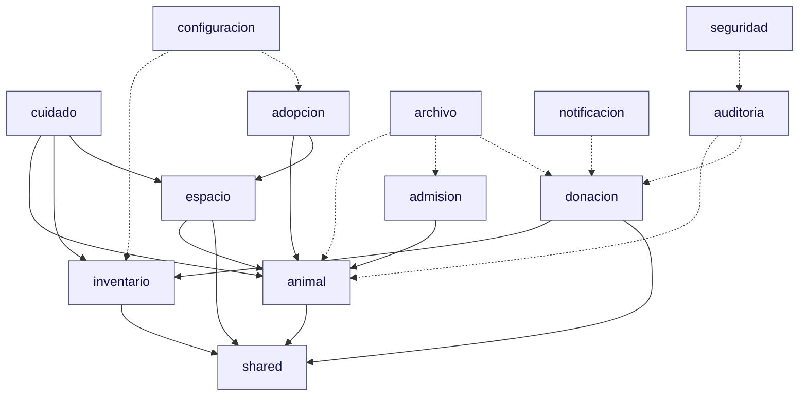
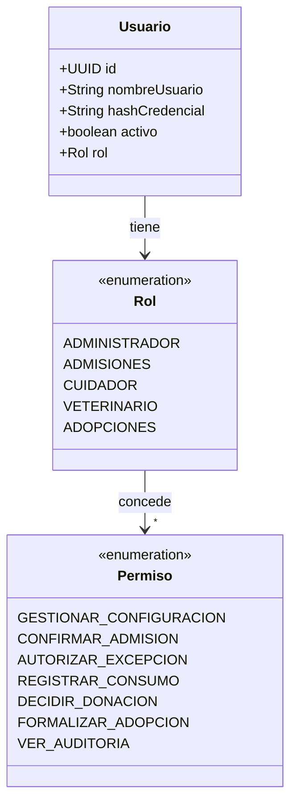
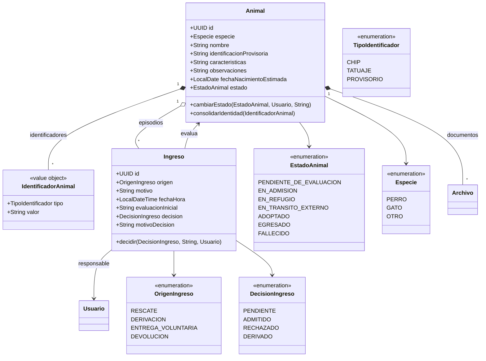
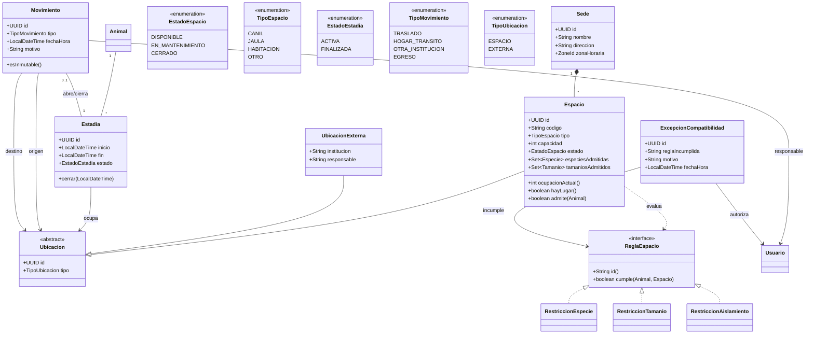
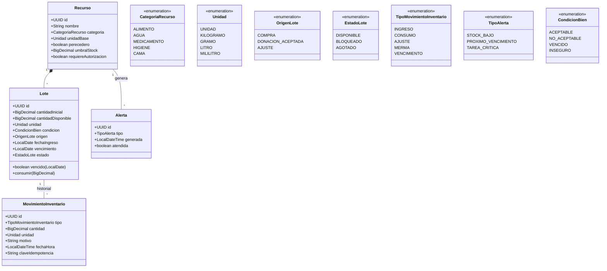
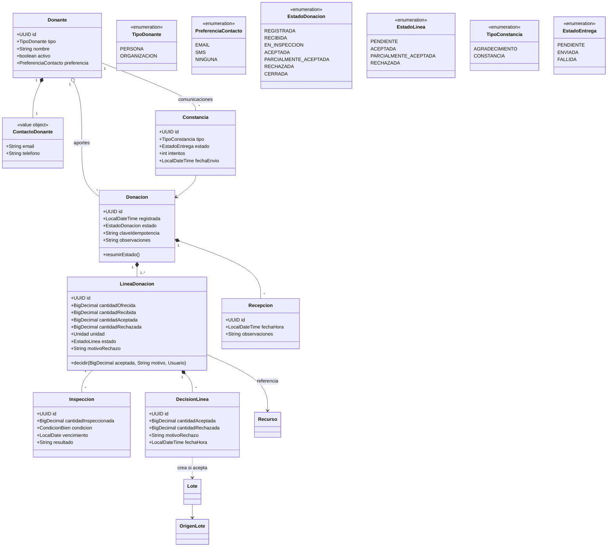
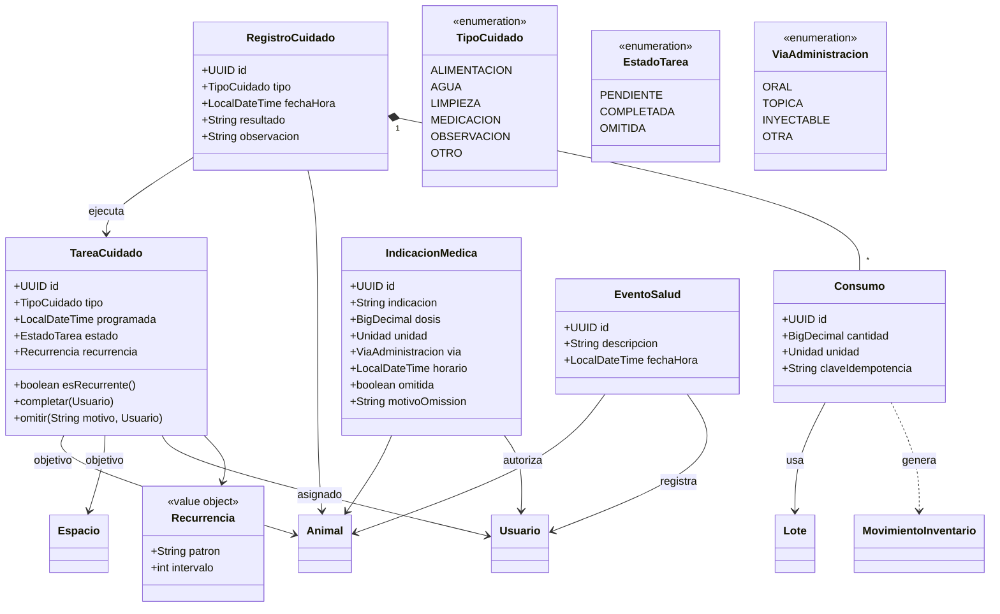
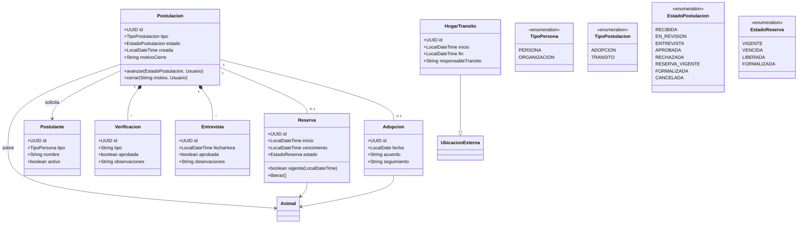
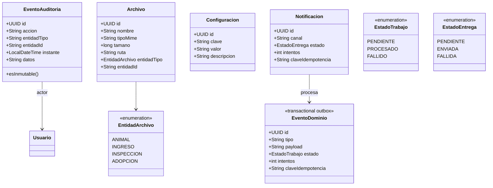
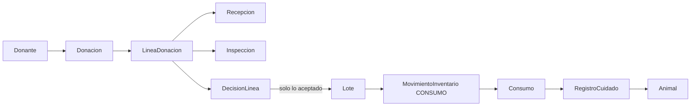

# Diagrama de clases — RefugioTrack

Modelo de dominio de la **Entrega 1** (dominio y diseño orientado a objetos). El diagrama
está partido por *bounded context* para que sea legible: cada sección se puede leer sola y
los nombres de clase son únicos en todo el modelo.

> Estado: diseño. El código Java de cada clase se implementa sobre esta base en los
> siguientes pasos. La estructura de paquetes ya existe bajo `src/main/java/com/refugiotrack`.

## Cómo leerlo

1. Empezá por el **mapa de módulos** para ver los límites y las dependencias.
2. Bajá al diagrama del módulo que te interesa (animal, espacio, inventario, donaciones, etc.).
3. Cerrá con **decisiones de modelado**, **enumeraciones** y **trazabilidad**.

**Leyenda**

| Notación | Significado |
|---|---|
| `*--` | Composición: la parte no existe sin el agregado raíz |
| `o--` | Agregación: referencia a otra entidad del dominio |
| `-->` | Asociación simple |
| `..>` | Dependencia (usa, no posee) |
| `<\|--` | Herencia |
| `..\|>` | Realización de interfaz |
| `"1"`, `"*"`, `"0..1"` | Multiplicidad |

---

## Mapa de módulos

Regla de dependencia: los módulos de dominio **no** dependen de infraestructura. `shared` no
depende de nadie; `seguridad` y `configuracion` son transversales.

---

## 1. Seguridad y personas

---

## 2. Animal e ingreso

Una **devolución** no reabre el ingreso anterior: crea un nuevo `Ingreso` con
`origen = DEVOLUCION` sobre el mismo `Animal`.

---

## 3. Sedes, espacios, estadías y movimientos

Invariantes clave (se resuelven en los casos de uso, no en la UI):

- Un `Animal` bajo cuidado tiene **exactamente una** `Estadia` `ACTIVA`.
- Un `Movimiento` cierra la estadía previa y abre la nueva de forma **atómica**.
- Un `Espacio` no supera `capacidad`; la ocupación cuenta animales, no historial.
- Las reglas son **componibles** (`ReglaEspacio` = patrón *Specification/Strategy*); una
  excepción exige `ExcepcionCompatibilidad` con motivo y auditoría.

---

## 4. Inventario

Reglas: el consumo referencia un `Lote` concreto, prioriza el lote apto de vencimiento más
próximo, nunca usa lotes vencidos y jamás supera lo disponible. `MovimientoInventario` es
inmutable (las correcciones son movimientos nuevos con motivo).

---

## 5. Donaciones en especie

Invariantes: `aceptada + rechazada <= recibida`; solo lo **aceptado** genera `Lote`; lo
rechazado o vencido queda en el registro de inspección para trazabilidad pero nunca en stock
utilizable; las correcciones se auditan, no sobrescriben.

---

## 6. Cuidados

El **registro de cuidado y el descuento de stock** se confirman juntos o no se confirma
ninguno (transacción). El sistema alerta tareas vencidas; no decide dosis.

---

## 7. Adopción y tránsito

No puede haber **dos reservas vigentes** para el mismo animal. El tránsito es una
`UbicacionExterna`, nunca una adopción.

---

## 8. Auditoría, archivos, configuración y outbox

`EventoAuditoria` **nunca** guarda credenciales ni secretos. `EventoDominio` implementa el
patrón *transactional outbox* (Entrega 2): se registra en la misma transacción del cambio de
dominio y se procesa después; los reintentos son idempotentes.

---

## Enumeraciones (resumen)

| Enum | Valores |
|---|---|
| `Rol` | ADMINISTRADOR, ADMISIONES, CUIDADOR, VETERINARIO, ADOPCIONES |
| `EstadoAnimal` | PENDIENTE_DE_EVALUACION, EN_ADMISION, EN_REFUGIO, EN_TRANSITO_EXTERNO, ADOPTADO, EGRESADO, FALLECIDO |
| `OrigenIngreso` | RESCATE, DERIVACION, ENTREGA_VOLUNTARIA, DEVOLUCION |
| `DecisionIngreso` | PENDIENTE, ADMITIDO, RECHAZADO, DERIVADO |
| `EstadoEspacio` | DISPONIBLE, EN_MANTENIMIENTO, CERRADO |
| `TipoMovimiento` | TRASLADO, HOGAR_TRANSITO, OTRA_INSTITUCION, EGRESO |
| `CategoriaRecurso` | ALIMENTO, AGUA, MEDICAMENTO, HIGIENE, CAMA |
| `OrigenLote` | COMPRA, DONACION_ACEPTADA, AJUSTE |
| `TipoMovimientoInventario` | INGRESO, CONSUMO, AJUSTE, MERMA, VENCIMIENTO |
| `EstadoDonacion` | REGISTRADA, RECIBIDA, EN_INSPECCION, ACEPTADA, PARCIALMENTE_ACEPTADA, RECHAZADA, CERRADA |
| `EstadoLinea` | PENDIENTE, ACEPTADA, PARCIALMENTE_ACEPTADA, RECHAZADA |
| `EstadoTarea` | PENDIENTE, COMPLETADA, OMITIDA |
| `EstadoPostulacion` | RECIBIDA, EN_REVISION, ENTREVISTA, APROBADA, RECHAZADA, RESERVA_VIGENTE, FORMALIZADA, CANCELADA |
| `EstadoReserva` | VIGENTE, VENCIDA, LIBERADA, FORMALIZADA |

---

## Trazabilidad donante → consumo

Cada eslabón conserva actor, instante y motivo cuando corresponde.

---

## Decisiones de modelado

| Tema | Decisión | Motivo |
|---|---|---|
| Reglas de espacio | `ReglaEspacio` como interfaz componible (Specification/Strategy) | Evita condicionales dispersos; cada regla se audita sola |
| Ubicación | `Ubicacion` abstracta con `Espacio` y `UbicacionExterna` | Unifica estadías internas y tránsito sin confundir adopción |
| Movimientos | Inmutables; las correcciones son movimientos nuevos | Preserva historial y auditoría |
| Inventario | `Lote` como unidad de trazabilidad; consumo referencia lote | Permite FIFO por vencimiento y cadena hasta el donante |
| Donaciones | `LineaDonacion` con decisión propia y `DecisionLinea` separada | Aceptación parcial e independiente por línea |
| Fechas | `LocalDate` para calendario (vencimientos) y `LocalDateTime` para instantes | La zona horaria se resuelve con `Sede.zonaHoraria` |
| Eventos | Patrón *transactional outbox* (`EventoDominio`) | No se pierde el evento ante fallo del proveedor y es reintentable |
| Idempotencia | `claveIdempotencia` en consumos, donaciones y trabajos | Reintentos sin duplicar efectos |

---

## Cobertura de la Entrega 1

- [x] Ingresos y fichas de animales (módulos `animal`, `admision`)
- [x] Espacios/capacidad, estadías y movimientos (`espacio`)
- [x] Reglas configurables evaluables y componibles (`ReglaEspacio`)
- [x] Inventario por lotes (`inventario`)
- [x] Donantes/donaciones con recepción e inspección por línea (`donacion`)
- [x] Registros de cuidado (`cuidado`)
- [ ] Clases Java + pruebas de invariantes (siguiente paso)

## Siguiente paso

Implementar las clases de cada módulo sobre esta base, empezando por `animal` y `espacio`
(las invariantes de ocupación son las que más condicionan el resto), con pruebas JUnit 5 +
AssertJ.
