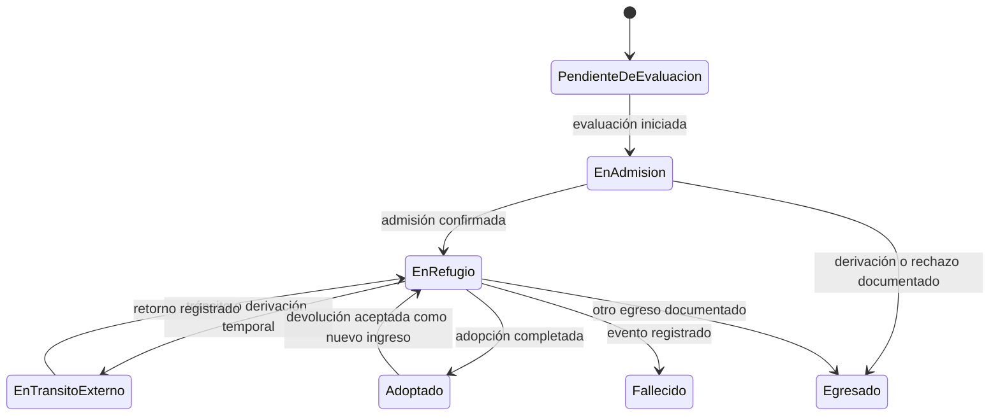

# **RefugioTrack — Gestión integral de un refugio animal**

Trabajo práctico integrador · Proyecto colaborativo de portfolio

## Contexto

Un refugio animal recibe animales en situaciones muy diversas: rescates, derivaciones, entregas voluntarias y devoluciones. Desde el primer contacto hasta la adopción o el egreso, el equipo debe coordinar espacios, alimentación, agua, medicación, higiene, turnos y personas voluntarias. También recibe donaciones en especie —por ejemplo, agua, alimento, camas y artículos de higiene— que deben inspeccionarse antes de incorporarse al inventario. El equipo necesita saber qué ocurrió, quién lo registró y qué recursos se consumieron.

En muchos refugios esta información se reparte entre planillas, mensajes y registros en papel. Eso dificulta conocer la ocupación real, anticipar faltantes, evitar asignaciones incompatibles y reconstruir el cuidado brindado a cada animal. **RefugioTrack** será una plataforma para coordinar ingresos, estadías, recursos y cuidados, con trazabilidad suficiente para operar con seguridad y explicar las decisiones del equipo.

El proyecto está pensado para un equipo de amistades que quiera construir una pieza sustancial de portfolio/CV, con desafíos adecuados para desarrolladores junior a semi-senior. El objetivo no es automatizar decisiones veterinarias ni imponer una política única a todos los refugios: el sistema registra información y aplica reglas operativas configurables por cada organización.

## Objetivos y límites

### Objetivos

- Modelar un dominio con ciclos de vida, restricciones e invariantes explícitas.
- Coordinar capacidad, estadías, movimientos, cuidados e inventario —incluidas donaciones en especie— sin perder historial.
- Exponer una API REST y procesar tareas asincrónicas e integraciones externas.
- Incorporar persistencia relacional, auditoría, pruebas y documentación mantenibles.
- Entregar un MVP demostrable y dejar extensiones avanzadas como decisiones separadas.

### Fuera del alcance obligatorio

- Diagnosticar, prescribir o recomendar tratamientos veterinarios.
- Reemplazar la evaluación profesional de compatibilidad o aptitud de adopción.
- Cobros, donaciones monetarias, contabilidad, nómina o gestión de múltiples organizaciones en una misma instalación. Las donaciones en especie sí forman parte del alcance.
- Aplicaciones móviles nativas, seguimiento GPS, ML o despliegue en Kubernetes.
- Integraciones reales con proveedores pagos: se admiten adaptadores simulados para la demo.

## Tecnologías sugeridas (no obligatorias)

Estas son una **pista por defecto** pensada en un equipo Java/backend: aceleran el camino sin ser un requisito. Cualquier stack equivalente es válido si el equipo documenta sus decisiones.

- **Lenguaje y runtime:** Java 17+ con **Spring Boot** (o Jakarta EE/Quarkus/Micronaut si el equipo lo prefiere).
- **Persistencia:** JPA/Hibernate sobre **PostgreSQL**, con **Flyway** para migraciones versionadas.
- **Validación:** Bean Validation (`jakarta.validation`) en las fronteras de entrada.
- **Seguridad:** Spring Security con hashing de credenciales y autorización por rol/acción.
- **Pruebas:** JUnit 5, AssertJ, MockMvc y **Testcontainers** para integración contra una base relacional real.
- **Documentación de API:** SpringDoc/OpenAPI generada desde el código.
- **CI:** GitHub Actions (o equivalente) con build y suite de pruebas en cada push/PR.

Si el equipo elige otra tecnología, debe justificarlo brevemente en los ADR y mantener los mismos criterios de aceptación.

### Frontend opcional para la demo

El foco principal del proyecto es backend. Para demostrar los flujos de punta a punta, alcanza con una interfaz web acotada para el personal del refugio; el portal público para donantes o postulantes queda como extensión.

- **Opción recomendada:** TypeScript con **React** y **Vite**, usando una biblioteca de componentes (por ejemplo, **MUI**) para acelerar formularios, tablas y navegación.
- **Alternativa:** **Vue 3** con TypeScript y **Vuetify**, si el equipo ya conoce Vue.
- **Integración:** consumir la API REST documentada; mantener las reglas de negocio y los permisos en el backend. El frontend no debe ser la única barrera de autorización.
- **Alcance sugerido:** vistas sencillas para animales/ingresos, ocupación, inventario/donaciones y cuidados. Se puede empezar con páginas mínimas o usar Swagger UI/clientes HTTP documentados mientras se completa la API.
- **Pruebas:** priorizar pruebas de los flujos backend; agregar pruebas de componentes o de extremo a extremo solo para los recorridos principales que la demo presente.

El frontend es opcional para las entregas de dominio y API, y no se espera una experiencia visual de producto comercial.

## Actores y permisos

| Actor | Responsabilidades principales |
|---|---|
| Administrador/a del refugio | Configura sedes, espacios, reglas, usuarios, catálogos y umbrales de inventario. Consulta auditoría e informes. |
| Responsable de admisiones | Registra avisos, evaluaciones iniciales e ingresos; administra documentación e identificación del animal. |
| Cuidador/a o voluntario/a | Consulta tareas asignadas y registra alimentación, agua, limpieza, observaciones y consumos autorizados. |
| Responsable veterinario/a | Registra indicaciones recibidas, medicación administrada y eventos de salud. El sistema no genera indicaciones clínicas. |
| Responsable de adopciones | Gestiona postulaciones, entrevistas, reservas, adopciones y hogares de tránsito. |
| Donante o persona postulante | El equipo registra y consulta los aportes del donante en el MVP. En una etapa posterior, el donante podrá consultar sus propios aportes, sin acceder a datos internos. |

Para el MVP, una interfaz sencilla o clientes HTTP documentados son suficientes. Se deben aplicar permisos por acción sensible; no es necesario construir un portal público completo.

## Conceptos del dominio

- **Animal:** identidad interna, especie, nombre o identificación provisoria, características conocidas, estado, observaciones y documentos. Los datos desconocidos deben poder quedar explícitamente sin informar.
- **Ingreso:** episodio que registra origen, motivo, fecha y hora, persona responsable, evaluación inicial y decisión de admisión. Un aviso o evaluación no equivale por sí solo a un ingreso confirmado.
- **Espacio de alojamiento:** canil, jaula, habitación u otro espacio de capacidad limitada, con sede, capacidad, especies/tamaños admitidos y restricciones configurables.
- **Estadía:** período durante el cual un animal ocupa un espacio o se encuentra bajo una modalidad de alojamiento registrada. Cada cambio de espacio cierra el tramo anterior y crea un movimiento nuevo.
- **Movimiento:** evento inmutable de traslado entre espacios, a hogar de tránsito, a otra institución o a un egreso. Incluye origen, destino, fecha, motivo y responsable.
- **Recurso inventariable:** alimento, agua embotellada (si el refugio la controla), medicamento, material de higiene o cama. Puede administrarse por unidad, masa o volumen según una unidad definida.
- **Donante:** persona u organización con datos de contacto protegidos y preferencias de comunicación. Su historial reúne ofertas, donaciones recibidas y constancias o agradecimientos enviados.
- **Oferta/registro de donación:** intención o registro operativo de un aporte en especie, vinculado a un donante. Una donación puede contener varias líneas con recurso, cantidad ofrecida/recibida y unidad.
- **Recepción e inspección:** registro de lo efectivamente recibido y de su cantidad, condición, vencimiento cuando aplique, resultado de inspección y responsable. La decisión se toma por línea y puede aceptar o rechazar cantidades parciales, con motivo para cada rechazo.
- **Lote:** recepción de una cantidad aceptada de un recurso con procedencia, fecha de ingreso, unidad, condición y, cuando corresponda, vencimiento. Conserva el vínculo con la línea de donación o con la compra que lo originó.
- **Registro de cuidado:** tarea planificada o acción realizada para un animal o espacio, con tipo, horario, responsable, resultado y, si aplica, consumo de inventario.
- **Postulación:** solicitud de adopción o tránsito con personas responsables, verificaciones, entrevistas, decisión y fechas relevantes.
- **Evento de auditoría:** actor, acción, entidad afectada, instante y datos necesarios para entender el cambio, evitando almacenar credenciales o secretos.

La organización puede definir catálogos y políticas (por ejemplo, especies aceptadas, criterios de aislamiento, duración de reserva y mínimos de stock). Los datos operativos deben guardar qué regla o decisión se aplicó cuando sea necesario para explicar un resultado posterior.

## Ciclos de vida e invariantes

### Animal e ingreso

El animal puede estar en uno de estos estados operativos: **Pendiente de evaluación**, **En admisión**, **En refugio**, **En tránsito externo**, **Adoptado**, **Egresado por otra causa** o **Fallecido**. El equipo debe documentar las transiciones permitidas y quién puede ejecutarlas. Una admisión rechazada o derivada se conserva como resultado del ingreso, pero no crea ocupación del refugio.

Una devolución no borra ni reabre el historial de la adopción: genera un nuevo ingreso vinculado al animal existente. La identidad puede ser provisoria al ingresar y consolidarse luego; el sistema debe prevenir duplicados probables sin impedir registrar un animal sin identificación disponible.

### Ocupación y movimientos

1. Cada animal admitido que permanece bajo cuidado del refugio debe tener exactamente una ubicación activa: un espacio interno o una modalidad externa registrada.
2. Un espacio no puede superar su capacidad. La ocupación cuenta animales, no estadías históricas.
3. Una asignación debe cumplir restricciones activas de especie, tamaño, aislamiento, estado del espacio y compatibilidad. Las reglas concretas son configurables; una excepción requiere autorización, motivo y auditoría.
4. No se pueden solapar dos estadías activas del mismo animal. Un traslado cierra la estadía anterior y comienza la nueva en una operación atómica.
5. Los movimientos no se eliminan ni se reescriben para corregir errores: se registra una corrección o reversión con motivo, actor e instante.
6. Un alta de capacidad, cierre de espacio o cambio de regla no debe invalidar silenciosamente ocupaciones existentes; el sistema informa el conflicto y exige resolverlo.

### Inventario y cuidado

- Compras, donaciones aceptadas y ajustes son orígenes distintos del stock y deben identificarse como tales; una donación nunca se registra como compra ni como ajuste. Las recepciones aceptadas aumentan existencias en lotes; los consumos, ajustes, mermas y vencimientos generan movimientos de inventario con cantidad, unidad, motivo, fecha y responsable. El historial no se sobrescribe.
- No se permite consumir más cantidad de la disponible. Un consumo debe referenciar el lote utilizado; para recursos con vencimiento, se prioriza el lote apto con vencimiento más próximo, salvo política configurada y justificada.
- Los lotes vencidos quedan bloqueados para consumo. La fecha de vencimiento es obligatoria solo para categorías configuradas como perecederas o sujetas a vencimiento.
- Un lote conserva su unidad, condición, procedencia y vínculo con el donante y la línea de donación, si corresponde. Cada movimiento mantiene su propio origen y auditoría, hasta el consumo asociado al registro de cuidado.
- El stock bajo se calcula por recurso y unidad contra un umbral configurable. Una alerta no modifica stock ni equivale a una orden de compra.
- Una tarea puede ser puntual o recurrente. Una acción completada identifica quién la realizó y cuándo. Si consume recursos, el registro de cuidado y el descuento de stock deben confirmarse juntos o no confirmarse ninguno.
- Medicación: registrar únicamente la indicación cargada por una persona autorizada, dosis/unidad, vía si aplica, horario, administración omitida y motivo. El sistema alerta sobre tareas vencidas o próximas, pero no decide una dosis ni sustituye criterio profesional.

#### Flujo de donaciones en especie

La donación recorre **Registrada/ofrecida → Recibida → En inspección → Aceptada, parcialmente aceptada o rechazada → Cerrada**. Cada línea mantiene su propio resultado y puede quedar pendiente mientras se completa su inspección; el estado general resume las líneas y no reemplaza su historial. Una oferta que no se concreta puede cerrarse sin recepción ni efecto sobre el inventario.

1. Se registra o identifica al donante (persona u organización), sus preferencias de contacto y una oferta o donación con una o más líneas. La oferta no aumenta stock.
2. Al recibirla, se registran cantidades efectivas por línea y se inspeccionan cantidad, condición y vencimiento cuando corresponda. Las reglas de unidad, condición aceptable y vencimiento se configuran por categoría/recurso; agua, alimentos, camas/ropa de cama e higiene no comparten necesariamente las mismas reglas. La medicación solo se acepta si cumple la política del refugio y la revisión de una persona autorizada.
3. La decisión por línea registra cantidades aceptadas y rechazadas y el motivo de cada rechazo. Se permiten aceptación parcial de una línea y resultados distintos entre líneas de la misma donación. Toda línea recibida debe quedar resuelta o explícitamente pendiente de inspección.
4. Solo las cantidades aceptadas generan lotes y movimientos de ingreso de tipo **Donación aceptada**. Cada lote conserva donante, donación/línea, unidad, condición, fecha de recepción y vencimiento si aplica. Los bienes vencidos al inspeccionarse deben rechazarse; lo rechazado, vencido o inseguro puede quedar en un registro de recepción/inspección o cuarentena para trazabilidad, pero nunca en stock utilizable ni como lote aceptado.
5. El consumo referencia el lote; así puede reconstruirse la cadena donante → línea de donación → recepción/inspección → lote → movimiento de consumo → registro de cuidado. El donante conserva historial y puede recibir constancia o agradecimiento conforme a sus preferencias.

**Invariantes de donaciones:** no se acepta más cantidad que la recibida; las unidades deben ser compatibles con el recurso; no existe lote utilizable sin decisión de aceptación; rechazos y vencimientos no aumentan stock utilizable; la suma aceptada y rechazada no supera lo recibido; las correcciones se auditan en lugar de sobrescribir decisiones o movimientos. Una donación registrada, inspeccionada, decidida, convertida en lotes, consumida o comunicada debe poder rastrearse con actor, instante y motivo cuando corresponda.

### Adopción y tránsito

Una postulación puede avanzar por **Recibida**, **En revisión**, **Entrevista/validación**, **Aprobada**, **Rechazada**, **Reserva vigente**, **Formalizada** o **Cancelada**. La organización configura qué verificaciones exige. Toda decisión negativa o cancelación conserva un motivo. Una reserva temporal tiene vencimiento configurable y no puede generar dos reservas vigentes para el mismo animal.

La formalización registra fecha, personas responsables, acuerdo/documentación y seguimiento si se utiliza. El hogar de tránsito se gestiona como ubicación externa con responsable, fechas y controles; no se confunde con una adopción. Retornos, cambios de hogar y extensiones de tránsito quedan en el historial del animal.

## Entregas progresivas

Las entregas construyen sobre el mismo dominio. El equipo puede reorganizar módulos o servicios si documenta límites, contratos y razones; no se exige comenzar con microservicios.

### Entrega 1 — Dominio y diseño orientado a objetos

**Alcance:** ingresos y fichas de animales, espacios/capacidad, estadías y movimientos, reglas configurables básicas, inventario por lotes, registro MVP de donantes/donaciones en especie con recepción e inspección por línea, y registros de cuidado. Persistencia en memoria o repositorios simples; el equipo puede cargar donaciones mediante una interfaz sencilla o clientes HTTP, sin portal público.

**Criterios de aceptación:**

- Se puede registrar un ingreso, admitirlo o derivarlo con motivo y asignar una ubicación válida.
- Se rechazan ocupación por encima de capacidad, incompatibilidad según reglas activas y doble ubicación del mismo animal.
- Un movimiento conserva la ubicación anterior y registra responsable, hora y motivo.
- Recepción, consumo y vencimiento de un lote quedan trazados; el consumo no excede stock ni utiliza lotes vencidos.
- Se puede registrar una donación multiítem, inspeccionar y aceptar/rechazar total o parcialmente cada línea; solo cantidades aceptadas generan lotes trazables y las rechazadas no incrementan stock utilizable.
- Las reglas configurables (especie/tamaño admitidos, aislamiento, compatibilidad) están modeladas con una estrategia evaluable y componible —por ejemplo, patrón Specification o Strategy— sin condicionales dispersos en los casos de uso; cada regla puede identificarse y auditarse al aplicarse.
- El equipo presenta modelo de dominio, diagrama de estados y decisiones relevantes con pruebas de reglas e invariantes.

### Entrega 2 — API, procesos asincrónicos e integraciones

**Alcance:** API REST, control de permisos básico, tareas recurrentes y notificaciones, postulaciones de adopción/tránsito, planificación de cuidados, reportes operativos y operaciones de donaciones. Integraciones desacopladas detrás de contratos; se pueden simular email/SMS, calendario o servicio de notificaciones. El registro de donaciones y su decisión son MVP; un portal de donantes e integraciones externas de donaciones son opcionales.

**API mínima sugerida:**

| Recurso | Operaciones representativas |
|---|---|
| `/animals`, `/intakes` | Alta/consulta, evaluación, admisión y derivación |
| `/spaces`, `/stays`, `/movements` | Capacidad, asignación, traslado y consulta de ocupación |
| `/inventory/items`, `/inventory/lots`, `/inventory/movements` | Catálogo, recepción y consumo/ajuste trazable |
| `/donors`, `/donors/{id}/history` | Alta/consulta de donantes, preferencias de contacto e historial de aportes/agradecimientos |
| `/donations`, `/donations/{id}/lines` | Registrar oferta/donación y sus líneas; consultar estado y cantidades |
| `/donations/{id}/receipts`, `/donations/{id}/inspections`, `/donations/{id}/decisions` | Registrar recepción, inspeccionar y aceptar/rechazar cantidades por línea con motivos; crear lotes solo por lo aceptado |
| `/care-tasks`, `/care-records` | Planificar, asignar, completar u omitir cuidados |
| `/applications` | Crear postulación, registrar revisión y formalizar o cerrar |
| `/reports` | Ocupación, animales alojados, tareas pendientes, consumo y stock bajo |

Los nombres y la granularidad pueden variar si se documentan contratos consistentes. Los cambios de estado deben exponerse como acciones de dominio cuando un CRUD genérico no exprese sus reglas. Las respuestas de error deben distinguir validación, conflicto de estado, falta de permisos y recurso inexistente.

**Errores estructurados:** las respuestas de error deben seguir un formato normalizado —por ejemplo, RFC 9457 (Problem Details) o un contrato propio equivalente— con tipo/título, estado HTTP, detalle accionable y, cuando aplique, el campo que causó el problema. Validación, conflicto de estado, permiso denegado y recurso inexistente deben distinguirse por código o tipo, no solo por el texto del mensaje.

**Seguridad concreta:**

- Autenticación real para las acciones internas: hashing de credenciales con un algoritmo actual (BCrypt/Argon2) y sesión o token (por ejemplo, JWT) con expiración razonable. No se guardan credenciales ni secretos en la auditoría ni en logs.
- Autorización por rol y acción a nivel de API, no solo en la interfaz: cada endpoint sensible aplica la matriz de permisos de la sección de actores.
- Los datos de contacto de donantes y postulantes se protegen en listados, reportes y logs; un usuario sin permiso no los obtiene por un endpoint indirecto.

**Procesos e integración:**

- Generar tareas recurrentes y recordatorios de vencimientos/stock bajo en segundo plano, evitando duplicar tareas ante reintentos.
- Emitir avisos ante admisión, traslado, tarea crítica omitida, stock bajo y cambios de una postulación, según preferencias y reglas de la organización.
- Encolar confirmaciones o agradecimientos de donaciones según preferencias del donante, sin exponer sus datos; un fallo de notificación no revierte la aceptación ya confirmada y los reintentos no duplican constancias.
- Proveer un adaptador simulado y un contrato reemplazable para al menos una integración (por ejemplo, correo o calendario). Las fallas externas no deben revertir una operación de dominio ya confirmada; deben quedar reintentables y visibles.
- Aceptar importación CSV de animales, inventario o donaciones con validación por fila, vista previa/resumen de errores y resultado reproducible. Las donaciones importadas usan una clave idempotente documentada (por ejemplo, sistema de origen + identificador externo y número de línea); una fila inválida no corrompe las válidas ni genera donaciones/lotes duplicados al repetir la misma importación.
- Garantizar que el evento o trabajo asincrónico no se pierda si la transacción de dominio se confirma: registrar la publicación en la misma transacción (por ejemplo, patrón *transactional outbox*) y procesarla después. Un fallo del proveedor externo deja el trabajo pendiente y visible, sin revertir el dominio ya confirmado ni duplicarlo al reintentar.

**Criterios de aceptación:** endpoints documentados con ejemplos; trabajos asíncronos observables; reintentos no duplican efectos; importación informa filas creadas, actualizadas, rechazadas y sus motivos; la integración puede probarse sin credenciales externas; los errores de API siguen el formato estructurado acordado; las operaciones sensibles exigen autenticación y el rol correcto; un evento de dominio confirmado sobrevive a un fallo del proveedor externo sin perderse ni duplicarse.

### Entrega 3 — Persistencia relacional y robustez

**Alcance:** persistir el modelo mediante ORM en una base relacional; diseñar esquema, relaciones, restricciones e índices; gestionar migraciones y transacciones. Cada módulo o servicio que el equipo haya separado debe ser dueño de sus datos y no compartir entidades internas como contrato.

**Criterios de aceptación:**

- Los datos sobreviven al reinicio y existe un mecanismo reproducible para inicializar y migrar la base local.
- La asignación concurrente de dos ingresos al último lugar disponible no excede capacidad.
- Traslado, consumo de inventario y finalización de cuidados mantienen invariantes frente a fallas parciales.
- La decisión de aceptación y la creación de lotes/movimientos correspondientes son atómicas; un reintento no duplica cantidades ni lotes.
- Se documentan modelo entidad-relación, normalización, restricciones, índices y toda desnormalización deliberada.
- Se elige y justifica una estrategia de concurrencia para los conflictos de capacidad y stock —bloqueo pesado u optimista con versión, por ejemplo— y se demuestra con una prueba de concurrencia real (dos hilos o solicitudes simultáneas) que el escenario "último espacio" nunca excede la capacidad.
- Se verifican flujos principales con pruebas de integración contra una base relacional de prueba —idealmente con Testcontainers o un equivalente que levante la BD desde cero— y pruebas de migraciones.
- Las consultas de informes y listados se revisan contra *N+1*: se identifican las consultas problemáticas, se corrigen (por ejemplo, fetch/join explícito o consulta agregada) y se justifican los índices añadidos sobre las columnas más filtradas u ordenadas.

## Requerimientos funcionales

1. **RF-01 — Configuración:** administrar sedes/espacios, capacidad, restricciones, catálogos, unidades y políticas operativas con validación de cambios.
2. **RF-02 — Admisión:** registrar aviso, origen, evaluación, evidencias y decisión; admitir, derivar o dejar pendiente sin perder el historial.
3. **RF-03 — Animales:** crear y consultar fichas, identificadores alternativos, características, documentos y observaciones con acceso acorde al rol.
4. **RF-04 — Ocupación:** consultar disponibilidad; asignar, trasladar y egresar animales; rechazar conflictos o registrar una excepción autorizada y auditada.
5. **RF-05 — Inventario:** registrar catálogos, lotes, recepciones de compra o donación aceptada con origen diferenciado, consumos, ajustes, mermas, vencimientos, stock bajo y alertas.
6. **RF-06 — Cuidados:** programar tareas puntuales/recurrentes, asignar responsables y registrar cumplimiento, omisión, observación y consumo asociado.
7. **RF-07 — Adopción/tránsito:** registrar postulaciones, verificaciones configurables, entrevistas, decisiones, reservas con vencimiento, formalización y retornos.
8. **RF-08 — Búsqueda e informes:** filtrar animales por estado/ubicación, consultar ocupación y movimientos, ver cuidados pendientes, consumo por período y recursos próximos a vencer o bajo umbral.
9. **RF-09 — API:** ofrecer operaciones REST versionables para los flujos acordados, validación consistente, paginación en listados y documentación OpenAPI o equivalente.
10. **RF-10 — Importación:** validar CSV, detectar duplicados según una clave documentada, ofrecer resumen previo y procesar con resultados por fila e identificador de ejecución.
11. **RF-11 — Notificaciones:** configurar eventos, destinatarios y canales disponibles; conservar estado de entrega y permitir reintento de fallas sin duplicar notificaciones exitosas.
12. **RF-12 — Auditoría:** registrar quién realizó cambios sensibles, qué entidad afectó y cuándo; las correcciones deben preservar el valor e historial anterior cuando sea necesario.
13. **RF-13 — Donaciones en especie:** registrar donantes y preferencias de contacto; ofertas/donaciones con múltiples líneas; cantidades recibidas, inspección y aceptación/rechazo parcial con motivos; crear lotes solo por cantidades aceptadas y conservar el historial y la procedencia hasta el consumo/cuidado. Permitir consultar el historial del donante y registrar constancias o agradecimientos según sus preferencias. No incluye pagos ni donaciones monetarias.
14. **RF-14 — Archivos y evidencias:** adjuntar documentos o fotos a un animal, un ingreso o una inspección (por ejemplo, certificados, consentimientos, evidencias de condición) con validación de tipo de archivo y tamaño, y vínculo trazable a la entidad. Si el equipo decide posponer el almacenamiento real, debe documentarlo como extensión con alcance propio; en todo caso, el modelo debe anticipar el vínculo entidad-archivo.

## Requerimientos no funcionales

- **Integridad:** toda regla de capacidad, exclusividad de ubicación y stock debe aplicarse también ante solicitudes concurrentes, no solo en la interfaz.
- **Idempotencia:** operaciones que puedan reintentarse (importaciones, callbacks, trabajos y consumos enviados de nuevo) deben aceptar una clave/idempotency token o una estrategia equivalente documentada.
- **Seguridad:** autenticar usuarios para acciones internas, autorizar según rol, validar entradas, proteger datos de contacto y no exponer información privada en reportes o logs. Credenciales con hashing actual; los permisos se verifican en el servidor, nunca solo en la interfaz.
- **Fecha y hora:** el modelo debe distinguir fechas de calendario (por ejemplo, vencimientos de lote) de instantes en el tiempo (por ejemplo, horarios de medicación). La zona horaria del refugio es una configuración; los vencimientos de reservas, tareas recurrentes y alertas se calculan sobre esa zona. Se evita el problema del "cambio de hora" (tareas cerca de medianoche, horarios de verano) y se documenta la convención elegida.
- **Disponibilidad de integraciones:** aislar proveedores externos mediante interfaces/adaptadores; aplicar timeout, reintentos limitados y registro de fallas. La demo debe funcionar en modo simulado.
- **Observabilidad:** incluir logs estructurados con correlación de solicitudes/trabajos, errores accionables y métricas básicas de ocupación y tareas, sin secretos ni datos sensibles innecesarios.
- **Calidad:** automatizar pruebas unitarias de dominio, pruebas de API/integración y al menos un flujo de extremo a extremo; acordar un piso de cobertura de código de dominio y hacerlo visible en CI; documentar cómo ejecutar todo localmente.
- **Arquitectura verificable:** si el equipo separa módulos o servicios, debe agregar al menos una regla automatizada de dependencias entre módulos (por ejemplo, con ArchUnit o una prueba equivalente) que falle el build si un módulo invade el interior de otro sin pasar por su contrato.
- **Integración continua:** un pipeline (GitHub Actions o equivalente) ejecuta build y suite de pruebas en cada push o pull request; su estado debe verse en el README.
- **Usabilidad:** mensajes de validación deben indicar el conflicto y cómo resolverlo; listados extensos deben permitir búsqueda y paginación.
- **Configurabilidad:** umbrales, categorías, vencimientos de reservas y reglas locales deben poder cambiarse sin modificar el código de los casos de uso, salvo decisiones estructurales justificadas.

## Escenarios para validar el modelo

1. **Último espacio:** dos operadores intentan asignar animales distintos al único lugar compatible disponible. Solo una operación se confirma; la otra recibe un conflicto y puede consultar disponibilidad actualizada.
2. **Aislamiento:** una regla configura aislamiento temporal tras el ingreso. El animal no puede ocupar un espacio común durante ese período; una excepción exige permiso, motivo y registro de auditoría.
3. **Traslado parcial fallido:** falla la persistencia al registrar un movimiento. El animal conserva la estadía original y no queda sin ubicación ni duplicado.
4. **Lote vencido y faltante:** hay dos lotes del mismo alimento, uno vencido y otro insuficiente. El sistema informa cuánto puede consumirse y rechaza el excedente sin usar el lote vencido.
5. **Cuidado omitido:** una dosis indicada no se administra en el horario previsto. Se registra como omitida con motivo y queda visible para seguimiento, sin generar una recomendación clínica automática.
6. **Reintento de integración:** el proveedor de correo demora y el trabajo se reintenta. El evento no se pierde ni genera múltiples avisos confirmados para la misma clave.
7. **CSV de donaciones repetido y reintento:** se importa dos veces el mismo archivo y se reintenta la misma decisión de aceptación con la misma clave idempotente. La segunda ejecución no duplica donaciones, líneas, lotes, movimientos ni agradecimientos; informa el resultado previo por fila. Una nueva donación real del mismo donante debe poder registrarse con otra clave.
8. **Reserva expirada:** una postulación tiene una reserva temporal que vence sin formalización. El sistema libera la reserva según la política configurada y conserva su historial.
9. **Devolución de adopción:** la organización recibe de vuelta un animal adoptado. El equipo registra un nuevo ingreso relacionado, conservando el episodio y acuerdo anteriores.
10. **Donación multiítem parcialmente aceptada:** se reciben alimento y camas. Se acepta solo parte del alimento tras inspección y se rechaza el resto con motivo; las camas se aceptan. Se crean lotes y stock únicamente por las cantidades aceptadas, cada uno enlazado a su línea, donante y condición.
11. **Bienes vencidos o rechazados:** una línea recibida está vencida o en condición insegura y se rechaza con motivo. Queda la evidencia de recepción/inspección para auditoría, pero no se crea lote utilizable ni aumenta el stock; un reintento tampoco puede incorporarla.
12. **Permiso denegado:** un usuario con rol de cuidador intenta ejecutar una acción reservada —por ejemplo, confirmar la admisión de un animal o registrar una excepción de compatibilidad—. La API rechaza la operación con el error estructurado de permiso, sin ejecutar parcialmente el cambio y sin filtrar datos protegidos en la respuesta.
13. **Medicación cerca de medianoche:** el refugio está configurado con una zona horaria no-UTC y una dosis programada cerca de las 00:00. La tarea aparece en el día correcto según la zona del refugio, no según UTC, y el vencimiento de la tarea se calcula sobre esa zona; el evento queda auditado con su instante absoluto.
14. **Consumo duplicado:** por un reintento o doble envío, llega dos veces la misma operación de consumo de un lote con la misma clave idempotente. El stock se descuenta una sola vez y el registro de cuidado no se duplica.

## Colaboración, documentación y portfolio

El equipo debe acordar contratos antes de trabajar en paralelo. Una división posible —no una obligación arquitectónica— es: **admisiones y ciclo del animal**, **espacios/estadías**, **inventario, donaciones y cuidados**, **adopciones e integraciones**, más una persona responsable de integrar contratos, pruebas y documentación. Cada responsabilidad debe definir entradas, salidas, invariantes y eventos; evitar que dos integrantes editen la misma regla de dominio de forma independiente.

### Entregables técnicos esperados

- Diagrama de contexto y límites de módulos/servicios, con justificación de decisiones y dependencias; incluir la trazabilidad donante-donación-lote-consumo/cuidado.
- Modelo de dominio/clases, diagrama de estados y diagramas de secuencia para admisión, traslado, consumo y adopción.
- Contratos REST y de eventos/trabajos; estrategia de idempotencia, reintentos y errores (incluido el formato estructurado de errores).
- ADR breves de las decisiones estructurales: estrategia de concurrencia para capacidad/stock, modelo de fechas y zona horaria, y mecanismo de publicación de eventos (por ejemplo, outbox).
- Diagrama entidad-relación físico, decisiones de normalización, migraciones y datos de demostración ficticios.
- README de ejecución local, variables de entorno de ejemplo sin secretos, arquitectura, decisiones (ADR breve) y guía de pruebas; badge o enlace del pipeline de CI con build y pruebas.
- Pruebas de reglas, casos límite, concurrencia relevante, API, integración simulada y persistencia; si hay módulos separados, la prueba automatizada de reglas de dependencias entre ellos.

### Demo de portfolio

En una demo de 8–12 minutos, el equipo debería poder: registrar y admitir un animal; asignarlo a un espacio; mostrar que un conflicto de capacidad o compatibilidad se rechaza; registrar un donante y una donación multiítem, inspeccionar y aceptar/rechazar parcialmente líneas, y mostrar que solo lo aceptado genera lotes; consumir un lote en una tarea de cuidado y recorrer la trazabilidad hasta el donante; procesar una postulación hasta una adopción o tránsito; consultar historial e informes; y mostrar una notificación/trabajo simulado, junto con las pruebas que protegen las invariantes.

El MVP se considera alcanzable cuando se completan los flujos de admisión, ocupación/movimientos, inventario/cuidado, registro e inspección de donaciones en especie y consulta con persistencia y pruebas. La gestión básica de donaciones no depende de un portal ni de una integración externa. Adopción completa, importación CSV de donaciones, portal de donantes, integraciones externas reales y analítica avanzada pueden entregarse en etapas o como extensiones. Las extensiones recomendadas son: múltiples sedes, portal de postulantes/donantes, reservas de turnos, tablero de capacidad, exportación de informes, carga de fotos con almacenamiento externo y sincronización con calendarios. Cada extensión debe tener un alcance y criterio de aceptación propios; no es requisito implementar todas.
